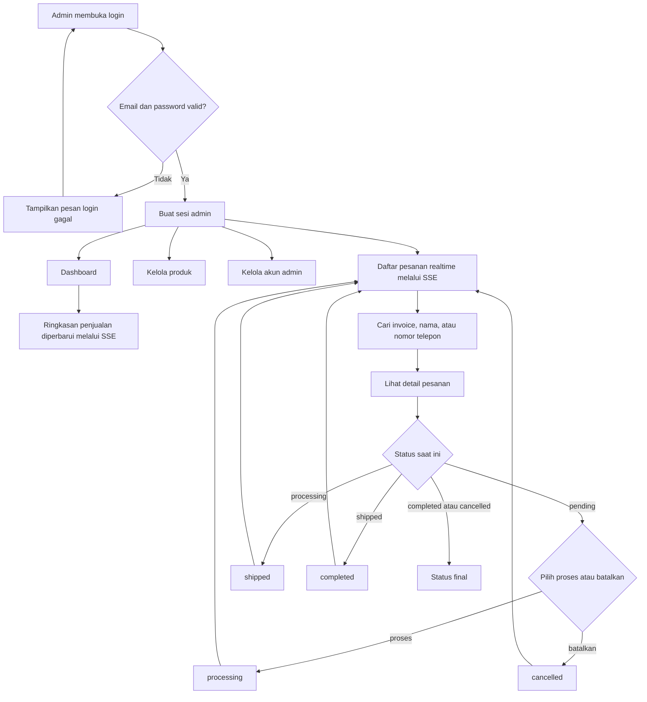

# Flowchart — Amarta Kopi

## Alur pembelian dan checkout

```mermaid
flowchart TD
    A[Pembeli membuka katalog] --> B[Cari atau pilih produk]
    B --> C[Lihat detail produk]
    C --> D[Pilih berat dan grind size]
    D --> E[Tambahkan ke keranjang]
    E --> F[Keranjang tersimpan di browser]
    F --> G[Ubah varian atau kuantitas bila perlu]
    G --> H[Pilih item untuk checkout]
    H --> I{Ada item terpilih?}
    I -- Tidak --> F
    I -- Ya --> J[Server validasi harga dan stok terbaru]
    J --> K{Item tersedia?}
    K -- Tidak --> G
    K -- Ya --> L[Pilih provinsi, kota, kecamatan, dan kode pos]
    L --> M{Lokasi ada di database?}
    M -- Tidak --> N[Ambil lokasi dari RajaOngkir dan simpan ke database]
    M -- Ya --> O[Ambil semua kurir aktif dari expeditions]
    N --> O
    O --> P[Kirim satu permintaan tarif untuk semua kurir]
    P --> Q[Buat quote bertanda tangan untuk setiap layanan]
    Q --> R[Tampilkan layanan berbagai kurir; pembeli pilih satu]
    R --> S[Isi kontak dan alamat jalan]
    S --> T[Checkout mengirim quote terpilih dan item terpilih]
    T --> U[Server validasi token, ekspedisi, tujuan, berat, harga, dan stok]
    U --> V{Quote valid dan belum kedaluwarsa?}
    V -- Tidak --> W[Tampilkan kesalahan; minta cek ongkir kembali]
    W --> O
    V -- Ya --> X[Hitung subtotal barang dan total termasuk ongkir]
    X --> Y[Buat invoice dan pesanan]
    Y --> Z[Simpan snapshot lokasi/kurir, order_items, dan kurangi stok]
    Z --> AA[Alihkan ke halaman sukses dengan invoice]
    AA --> AB[Tampilkan invoice, item, berat, grind size, ongkir, dan total]
    AB --> AC[Pembeli dapat melacak pesanan dengan invoice]
```

## Alur admin dan pemrosesan pesanan

```mermaid
flowchart TD
    A[Admin membuka login] --> B{Email dan password valid?}
    B -- Tidak --> C[Tampilkan pesan login gagal]
    C --> A
    B -- Ya --> D[Buat sesi admin]
    D --> E[Dashboard]
    E --> F[Ringkasan penjualan diperbarui melalui SSE]
    D --> G[Kelola produk]
    D --> H[Kelola akun admin]
    D --> I[Daftar pesanan realtime melalui SSE]
    I --> J[Cari invoice, nama, atau nomor telepon]
    J --> K[Lihat detail pesanan]
    K --> L{Status saat ini}
    L -- pending --> M{Pilih proses atau batalkan}
    M -- proses --> N[processing]
    M -- batalkan --> O[cancelled]
    L -- processing --> P[shipped]
    L -- shipped --> Q[completed]
    L -- completed atau cancelled --> R[Status final]
    N --> I
    O --> I
    P --> I
    Q --> I
```
